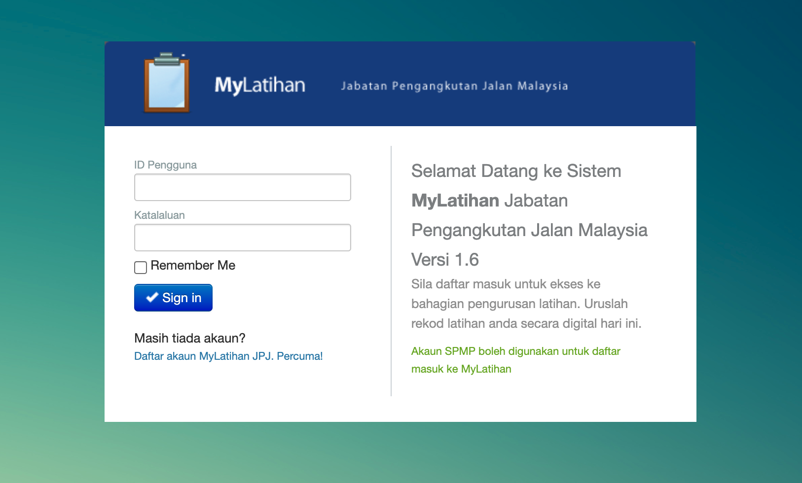

# Getting Started

## Capaian Sistem

## Daftar Masuk



## User ID

Sistem mylatihan menggunakan akaun SPMP dan juga mylatihan untuk daftar masuk sistem. Bagi anda yang mempunyai akaun SPMP, anda boleh daftar masuk menggunakan akaun SPMP bagi menguruskan maklumat latihan.

Please see the [project license](login.md) for further details.


Image with HTML tag

    


*Above: Cupcake indexer in progress*

    First Header | Second Header | Third Header
    ------------ | ------------- | ------------
    Content Cell | Content Cell  | Content Cell
    Content Cell | Content Cell  | Content Cell

First Header | Second Header | Third Header
------------ | ------------- | ------------
Content Cell | Content Cell  | Content Cell
Content Cell | Content Cell  | Content Cell


| First Header | Second Header | Third Header |
| ------------ | ------------- | ------------ |
| Content Cell | Content Cell  | Content Cell |
| Content Cell | Content Cell  | Content Cell |

First Header | Second Header | Third Header
:----------- |:-------------:| -----------:
Left         | Center        | Right
Left         | Center        | Right


```
Fenced code blocks are like Standard
Markdown’s regular code blocks, except that
they’re not indented and instead rely on
start and end fence lines to delimit the
code block.
```

> Dorothy followed her through many of the beautiful rooms in her castle.

I love supporting the **[EFF](https://eff.org)**.
This is the *[Markdown Guide](https://www.markdownguide.org)*.
See the section on [`code`](#code).

List

1. Siti Nur Farhan
2. Aishah
3. Kenapa list tak menjadi
4. Hey Hey Hey

List Baru

1. Siti Nur Farhan
1. Aishah
1. Kenapa list tak menjadi
1. Hey Hey Hey